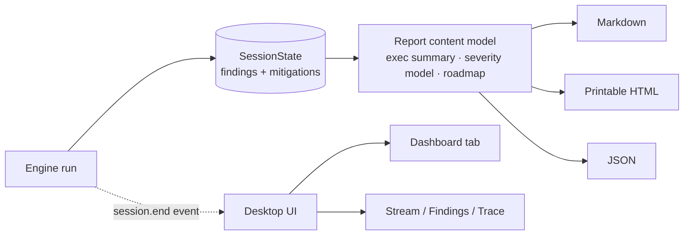
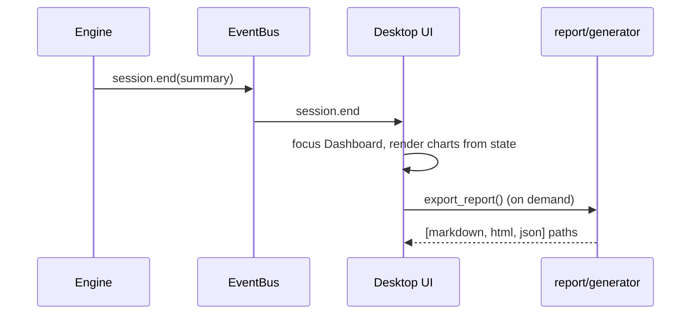

# Report + Dashboard + Single-Interface UI — Architecture Brief

- Status: **PROPOSED** (awaiting approval — no implementation yet)
- Date: 2026-10-02
- Class: **Non-trivial** (multi-module: config, desktop bridge, web UI, report generator, tool schema, prompts)

## Problem & Outcome

The desktop app carries a half-wired two-experience model (**Simple / Developer**):
`config.UISettings.experience` + `developer_mode`, a picker in Settings, and dozens of
`data-exp` / `.dev-only` toggles across `index.html`, `app.js` and `styles.css`. "Simple"
was never a distinct interface — it only relabels the same audit cockpit. The generated
report is a thin, non-standard dump that does not match how a real penetration-test report
is structured, and there is no at-a-glance result view when a run ends.

**Outcome:** one coherent cockpit; a **professional, structure-fixed printable HTML report**
(CVSS/CWE/OWASP fields, executive summary, methodology, remediation roadmap) that is
**byte-stable for identical session data**; and a **post-audit Dashboard** that summarises
the engagement. Success is measured by: (a) existing 393 tests stay green plus new
snapshot tests assert the report section set, (b) no remaining reference to the removed
experience model, (c) the Dashboard renders counts/resilience/timeline from a finished
session.

## Constraints

- **English** report (decided). UI stays English.
- **No new runtime dependency**: printable HTML + CSS A4 page breaks; no WeasyPrint/reportlab.
- **AI only fills structured finding fields**; the document structure is produced by code,
  so output cannot drift between runs.
- Windows-first desktop (pywebview + WebView2); assets ship in the wheel (`pyproject`
  package-data + CI wheel check already assert this).
- Python 3.10+, offline test suite (`SPLITAGENT_HOME` isolated), ruff clean.

## Non-Goals

- No binary PDF generation, no external template engine (Jinja2), no report localization,
  no per-client branding, no chart library, no server component, no changes to the
  encryption/session format beyond additive fields.

## Current State (brownfield)

- `splitagent/report/generator.py` — `build_markdown/build_html/build_json`; section set is
  ad-hoc (Executive summary, Findings, Round timeline, Notes).
- `splitagent/core/models.py` — `Finding` has title/category/description/severity/CVSS/
  target/endpoint/evidence/recommendation/references/confidence/status. Missing
  **CWE, OWASP, business impact, reproduction steps**.
- `splitagent/tools/knowledge.py::_record_finding` + its JSON schema — the AI's only way to
  populate a finding.
- `splitagent/config.py` — `UISettings.experience/experience_chosen/developer_mode`.
- `splitagent/desktop/api.py` — `set_experience`, `bootstrap.ui.*`.
- `splitagent/desktop/app.py:238` — increments `ui.audits_completed`.
- `splitagent/desktop/web/{index.html,app.js,styles.css}` — the experience UI.
- `.body { grid-template-columns: 272px 1fr 384px }`, window `min_size=(1100,700)`; no
  width media queries.

## Options & Trade-offs

### Report structure

| Dimension | A. Deterministic renderer (code) | B. Jinja2 template files | C. AI writes the report |
| --- | --- | --- | --- |
| Consistency (the ask) | **Perfect — code, not prose** | High | Low/variable |
| Dependencies | none | + Jinja2 | none (but LLM cost) |
| Customization | code change | user-editable | prompt change |
| Testability | snapshot-friendly | snapshot-friendly | hard/non-deterministic |
| Failure modes | template bug only | template load/parse | hallucination, truncation, cost |
| Time to value | medium | medium+ | low but risky |

**Deciding constraint:** the explicit user complaint "the AI must not always produce
something different" → structure must be code-owned. **Decision: A.**

### Dashboard

| Dimension | A. Review-panel tab + inline SVG | B. Separate full-screen route | C. Chart library |
| --- | --- | --- | --- |
| Complexity added | low | medium | medium (+dep) |
| Reuses live state | fully | yes | yes |
| Fits existing shell | yes | new layout | yes |
| Responsiveness work | small | large | small |

**Decision: A**, opening automatically when `session.end` arrives.

### Remove Simple/guided

Only one viable shape (delete the branch). Legacy config keys are ignored by
`_dataclass_from_dict` and rewritten on next save → **two-way door**.

## Decision

1. **ADR-0001** — Report is a deterministic, code-owned professional template; the AI is
   constrained to filling structured `Finding` fields.
2. **ADR-0002** — Remove the Simple/guided experience entirely; keep one Developer cockpit.
   Remove agent avatars (name only). Keep `audits_completed` as a plain counter.
3. **ADR-0003** — Post-audit Dashboard is a review-panel tab rendered from live session
   state with inline SVG/CSS (no chart dependency), auto-focused on `session.end`.

## Data Model & Contracts

Additive fields on `Finding` (all defaulted, back-compatible):

```
cwe: str = ""            # e.g. "CWE-89"
owasp: str = ""          # e.g. "A03:2021 — Injection"
impact: str = ""         # business impact, plain language
reproduction: str = ""   # numbered steps / PoC commands
```

`record_finding` schema and Red prompt updated to request them (kept optional so existing
runs still record findings). Report derives everything else (exec summary, severity model
table, remediation roadmap, retest status) from `SessionState` + `resilience_breakdown()`.

Report sections (fixed order): Cover/document control → Executive summary → Scope &
rules of engagement → Methodology & standards → Severity model → Findings summary table →
Detailed findings (repeatable block) → Remediation roadmap → Retest & status →
Appendices (usage/tools) → Limitations & disclaimer.

## Failure Modes & Operations

- Missing optional fields render an explicit "Not provided" cell — never raise.
- All interpolated text escaped (`html.escape`); evidence kept verbatim but the report keeps
  the existing "authorised testing / human review" disclaimer.
- Dashboard empty state when no session has run.
- Report generation stays offline and side-effect-free; no network.

## Security & Privacy

No new trust boundary. Risks: evidence may embed credentials/tokens captured during a test.
Mitigation: keep the human-review disclaimer; note in docs that evidence should be reviewed
before distribution. CWE/OWASP are client-supplied strings → escaped.

## Diagrams





## Architectural Acceptance Criteria

- [ ] HTML report contains every fixed section for any non-empty session, with the
      repeatable finding block carrying ID/title/severity/CVSS+vector/CWE/OWASP/asset/
      description/impact/evidence/reproduction/remediation/status.
- [ ] Report output is deterministic: identical `SessionState` → identical document
      (snapshot test).
- [ ] Zero references to `experience`, `experience_chosen`, `developer_mode` remain in
      `splitagent/`; a legacy config containing those keys loads without error.
- [ ] No `.avatar` node is emitted for any agent or the user; message headers show
      name + time only.
- [ ] Dashboard renders severity counts, resilience, top findings and round timeline, and
      an empty state with no run.
- [ ] No horizontal scroll and usable layout down to the 1100px window minimum.
- [ ] `ruff check`/`format` clean; full test suite green; wheel still ships web assets.

## Ready-to-Implement Checklist (ordered; make the change easy first)

1. **Prereq refactor** — extract a report content model + section builders in
   `report/generator.py`; add snapshot tests for the current output.
2. Add `Finding` fields + `record_finding` schema + prompt guidance (additive).
3. Rewrite `build_html` (printable, full sections, A4 CSS) and `build_markdown` to match.
4. Remove the experience model: `config.UISettings`, `desktop/api.py`, `desktop/app.py`,
   `index.html`, `app.js`, `styles.css`; delete avatars and keep names.
5. Add Dashboard tab (HTML + JS render + inline SVG + CSS) and auto-focus on `session.end`.
6. Responsive pass: width media queries at ~1280px and ~1000px (narrow columns, hide/collapse
   sidebar & review).
7. Tests: report snapshot + section presence; config legacy-key load; JS-level smoke via
   existing desktop tests where possible; UI tests updated.

## Open Questions / Assumptions

- **Assumption:** "quitá eso de la versión simple" = delete Simple entirely (confirmed via
  Q&A: "Sacar el selector").
- **Assumption:** Dashboard is read-only and reuses existing events; no new backend API
  surface beyond additive report fields.
- **Open:** whether the report should also offer a plain "executive one-pager" export
  separately — deferred to a follow-up (non-goal here).
